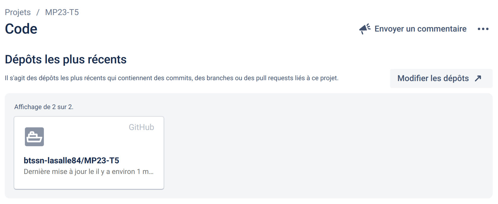
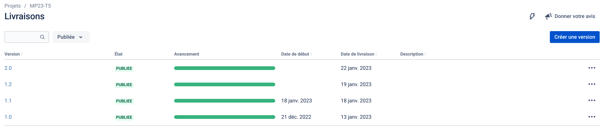
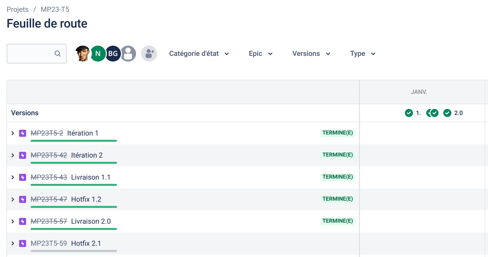
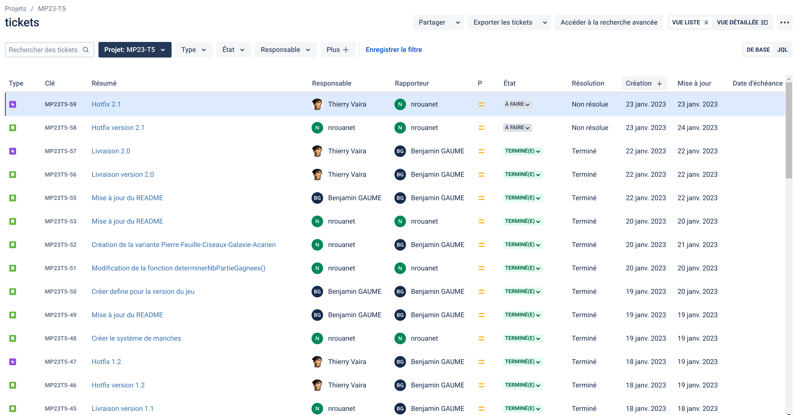

 

# Mini-projet : Chifoumi

## Présentation

Deux joueurs choisissent simultanément un des trois coups possibles en le symbolisant de la main. Ils ont le choix entre la pierre, la feuille, et le ciseau :
    - La pierre bat le ciseau en les émoussant
    - La feuille bat la pierre en l’enveloppant
    - Le ciseau bat la feuille en la coupant

Il existe plusieurs versions du Chifoumi mais celle avec la pierre, la feuille et le ciseau, est la version classique du jeu.
Dans ce jeu, nous disposons d'une version supplémentaire, qui possède les trois coups de base, avec la galaxie et l'acarien en plus :
    - La galaxie dématérialise la pierre, la feuille et le ciseau, 
      mais implose à cause de l'acarien
    - L'acarien se fait écraser par la pierre, la feuille, et le ciseau

Ainsi, (pour la version classique) chaque coup bat un autre coup, fait match nul contre le deuxième (son homologue) et est battu par le troisième.
Il est possible de joueur plusieurs manches dans une partie. Le joueur ayant gagné le plus de manches gagne la partie.

---

> Ceci est un mini-projet de 2 étudiants de BTS SN option Informatique & Réseaux développé en C++. L'objectif était la mise en oeuvre d'une méthode agile [Kanban](https://fr.wikipedia.org/wiki/Kanban_(d%C3%A9veloppement)) avec les outils **Jira / Github** et en appliquant le _workflow_ [Gitflow](https://btssn-lasalle84.github.io/guides-developpement-logiciel/jira.html#ancre-gitflow). L'application devait être limitée à une interface en ligne de commande (console).

---

## Jira

Intégration avec Github :

### Les versions

### Feuille de route

### Tickets

## Recette

|Fonctionnalités - Version 1.0            |Oui|Non|
|-----------------------------------------|:-:|:-:|
|Saisir le nom du joueur                  | X |   |
|Jouer une partie ou plusieurs parties    | X |   |
|Afficher l’historique des parties jouées | X |   |

|Fonctionnalités - Version 2.0            |Oui|Non|
|-----------------------------------------|:-:|:-:|
|Choisir une variante                     | X |   |
|Jouer une partie en plusieurs manches    | X |   |

## Ressources logicielles

- Développement sur Visual Studio Code
- GitHub
- Langage utilisé : C++

## Auteurs

- Benjamin GAUME      <benjamin.gaume.pro@gmail.com>
- Nicolas ROUANET     <rouanet.nicolas.pro@gmail.com>

---
©️ BTS SNIR LaSalle Avignon 2023
